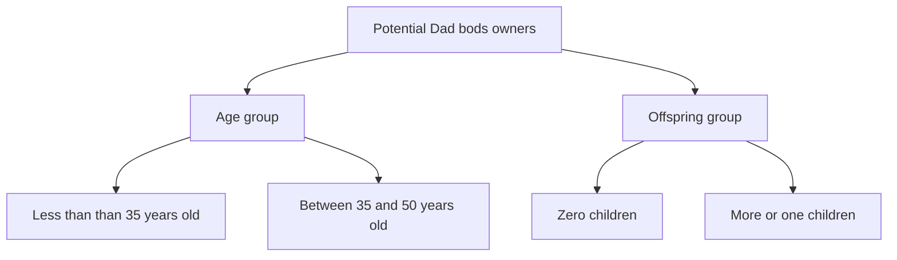

## Introduction

This repository was created for purposes of Data Science career path at codecademy. This is a third version of README file, with changes listed below:

- updated insurance price vs BMI scatterplot,
- improved scaling and visualisation of average parents age chart,
- additional charts and analysis. 

So, first things first: I was given a task to have fun and create few graphs to explore possible correlations between data that I received (it contained US Medical Insurance prices). My main challenge was to use as many dictionaries as possbile, to show that I have a good understanding of them. In the second update, to make it faster and easier, I used pandas as well as seaborn. I won't be discussing code here, but I would like to list packages that I used in this small project:

- csv,
- matplotlib,
- numpy,
- setuptools (needed only if you want to have a jumpstart in installing packages),
- pandas,
- seaborn.

To learn more about dataset that I used visit [Kaggle](https://www.kaggle.com/datasets/mirichoi0218/insurance).

## Running code

To run the program type: `python3 insurance_analysis.py` in your terminal. Program runs in a simple loop, in which you can choose from three analyses. This is how it looks after typing the command above:

  

Select graph or information that you would like to see. Graphs will pop up in new window (option number 2 and 3) and text analysis will be shown in terminal (option 1). 
After closing it, program will ask you whether to continue or not. Obviously, everyone can make typos sometimes, but no worries! Program is well-equipped to fight it! 😁

To see new, updated charts - run the `python3 parentsvol2.py` in the terminal.

## Analysis
To start analyzing what's happening there, let me explain some of the data metrics:

- *price* - price of insurance in USD of considered person,
- *smoking status* - tells us if person smokes or not; 1 for smoking person, 0 for non-smoking person,
- *BMI* - Body Mass Index of considered person,
- *Dad bod* - slang term in popular culture referring to a body shape particular to middle-aged men [from Wikipedia](https://en.wikipedia.org/wiki/Dad_bod).

### What is the relationship between smoking status and insurance price?

  

Comparing an average price of insurance between smoking and non-smoking people is a simple, yet quite powerful information. Obviously, I didn't take into account many other things like age or number of children, but I think that smoking not only kills you, but also kills your wallet.

### What is the relationship between person's BMI and insurance price?

  

> Okay, okay I know - this polynomial regression is kind of an overkill. Still, I wanted to create something that may contain more information rather than scatterplot of every individual in the datset. I'm also aware of the outliers, but I wanted to create a visualistion of every single entry in the datset. In the next release, I will work on it and create more meaningful graph.

Yeah, about that. Well, I decided not to exclude outliers from relationship between BMI and insurance price. Even though they are outstanding from the whole dataset, I’m not creating a ML model and I thought that it would be good to visualise them with the rest of the entires in the dataset.

As most of the people in provided dataset fall within Overweight and Obese weight range, you can see the most dense spot is approximately between 25 and 35 BMI. Even though these ranges are considered as unhealthy or even life-threatening, one can deduct that BMI isn't considered as a prime metric when calculating insurance price.
After closing the graph, you can see additional statistics about weight ranges.

### What is the average age of parents in dataset?

  

> This one was done out of curiosity. Whole numbers on the x axis represent number of children of parent. As you can see, the only clear trend is that the more the children, the older the parents are. What surprised me to be honest, is the average age of parents without children.

This is chart inspired me to dig further into this relationship, because when you look closely at it, parents with one and two children have nearly the same average age. It may be that data in this dataset was engineered to do excatly that, but nevertheless, let's look closer at the comparison between these two groups:

### The parents
Here is a distribution of charges between males and females in two groups:

  

Looking at the boxplot, you can notice that while female's IQRs are nearly the same, males' IQRs are a bit different. What is more, median female raising one child pay less for insurance than males raising one child. The situation is quite different between parents with two children - median female pay more than median male for insurance. While one can wonder why is that, let's look at distribution of insurance charges between males:

### The fathers

  

To get more information, I added smoking status to chart. Boxplots and medians are nearly the same, but to my surprise, the highest insurance charge was in smoking-one-child-male group. After this step, I decided I won't be digging more into relationships between those two groups. Those two groups are very similar: the average age, the distribution of insurance charges, even between two sexes and smoking statuses are nearly alike.

### Dad bod
This was an interesting idea that came to my mind during the creation of previously shown charts. Dad bod. Is the 'Dad' in the Dad bod related to the offspring status or the age? Obviously, this dataset isn't representative of whole potential owners of Dad bods, so let's just look at average BMI in two groups divided into two subgroups:

Without further ado, let's see the results:

  

Results are somewhat unexpected? As expected, males less than 35 years old have the smallest average BMI of all the subgroups considered and fathers have the highest. On the other hand, childrenless males have higher average BMI than middle-aged males. This is probably caused by the older males who are childrenless, since I didn't put a restriction on entries in offspring group other than children count. 

So, probably the conslusion is that this comparison is inconclusive, but one can make a strong argument for the offspring group thesis.

## To sum up...
The key take-aways from this analysis?
- smoking affects your insurance price very severely,
- BMI doesn't affect your insurance price as much as one could think,
- dataset of parents with one or two children are very similar,
- "Dad" in Dad bod is probably connected to offspring count, not age,
- even though I can't identify from which year provided dataset was, I can say that people start a family older and older.

Last, but not least, I have a confession to make. At the last stages of writing up this README, I realised that I should've created a correlation heatmap to see which data was worth pursuing. So, here it is:

  

My intuition was right and BMI doesn't affect insurance charge as much as age.
You might say, "But this heatmap shows clearly that correlation between age and BMI is stronger than between BMI and children!'. This is correct but it shows correlations between whole data, data including females. I have one item on my TODO that I'll be more to happy to do in my freetime concerning Dad bods stay tuned!

Thank you for reading this analysis, I really encourage you to play around with my code. This was a great learning experience and I hope you enjoyed it.

